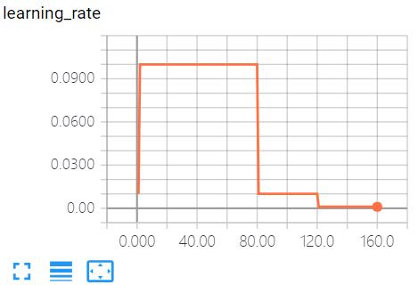
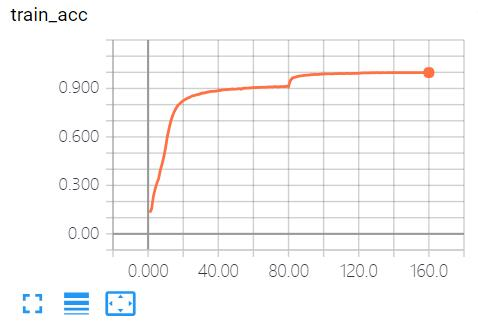
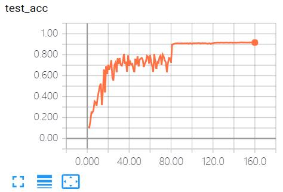

# Resnet-tensorflow
110 layers resnet
## dataset
This implementation supports cifar10
## Dependencies
tensorflow version 1.2.1
## Training
sbatch sub.sh
## Training
python train_resnet.py 
## Learining rate strategy
 
## Result
 
